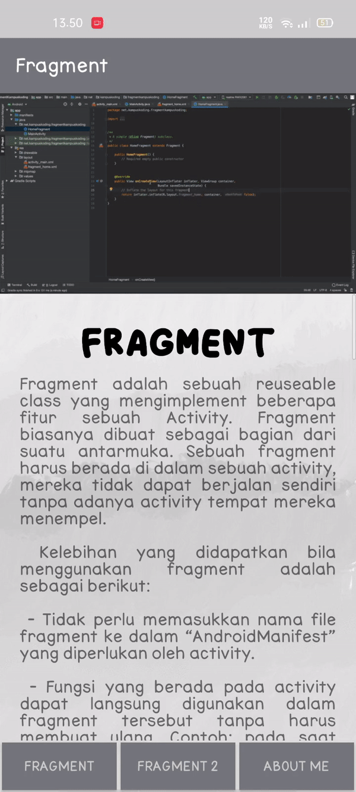
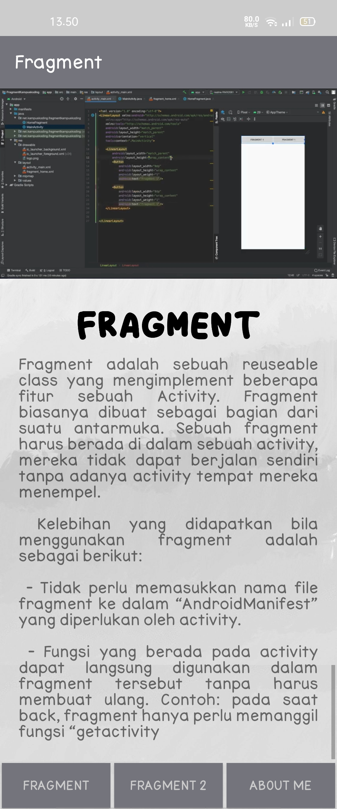
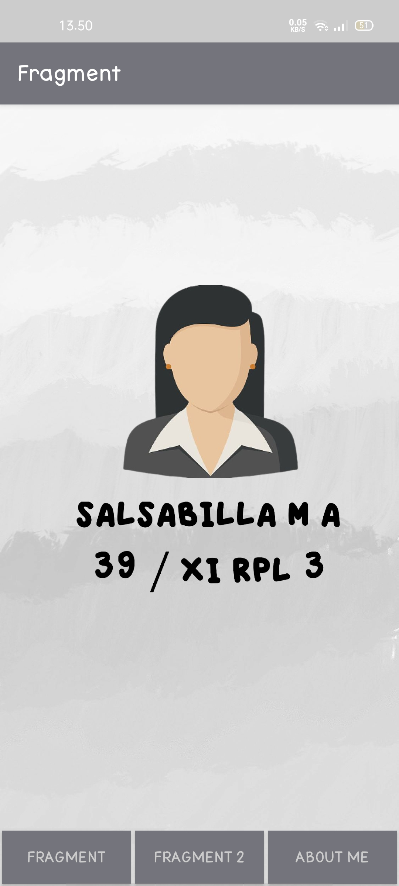

# Fragment

Fragment adalah sebuah reuseable class yang mengimplement beberapa fitur sebuah Activity. Fragment biasanya dibuat sebagai bagian dari suatu antarmuka. Sebuah fragment harus berada di dalam sebuah activity, mereka tidak dapat berjalan sendiri tanpa adanya activity tempat mereka menempel.

Contoh : bagaimana dua modul UI yang ditentukan oleh fragmen bisa digabungkan ke dalam satu aktivitas untuk desain tablet, namun dipisahkan untuk desain handset. 

Misalnya—untuk melanjutkan contoh aplikasi berita—aplikasi bisa menyematkan dua fragmen dalam Aktivitas A, saat berjalan pada perangkat berukuran tablet. Akan tetapi, pada layar berukuran handset, ruang untuk kedua fragmen tidak cukup, sehingga Aktivitas A hanya menyertakan fragmen untuk daftar artikel, dan saat pengguna memilih artikel, Aktivitas B akan dimulai, termasuk fragmen kedua untuk membaca artikel. Sehingga, aplikasi mendukung tablet dan handset dengan menggunakan kembali fragmen dalam kombinasi berbeda, seperti diilustrasikan dalam gambar 1.

 # Lifecycle Fragment
 
 Fragment memiliki banyak method yang dapat di override seperti halnya Activity:

- onAttach() dipanggil saat sebuah fragment terhubung ke activity.

- onCreate() diapnggil saat sebuah fragment dibuat (objeknya di memori).

- onCreateView() dipanggil saat fragment sudah siap membaca sebuah layout.

- onViewCreated() dipanggil setelah onCreateView() dan memastikan layout yang dibaca fragment adalah non-null. Semua pengaturan view seperti pembacaan findViewById, menambah onClickListener dapat dilakukan di sini.

- onActivityCreated() dipanggil setelah activity pembaca sudah menyelesaikan onCreate()-nya.

- onStart() dipanggil setelah fragment siap untuk ditampilkan di layar.

- onResume() - Dipakai untuk melakukan pembacaan data yang lebih “rumit” seperti lokasi, sensor, dll.

- onPause() - Tempat melepas data “rumit”. Lakukan commit di sini.

- onDestroyView() dipanggil saat layout sebuah fragment akan dihapus dari memori, namun fragmentnya masih ada di memori.

- onDestroy() dipanggil jika fragment sudah tidak dipakai.

- onDetach() dipanggil saat fragment tidak lagi terhubung ke sebuah activity.

> ### Urutan eksekusi lifecycle dapat dilihat pada gambar di bawah:

Yang paling sering di override adalah onCreateView karena hampir setiap fragment akan memerlukan sebuah layout, onCreate saat ingin menginisialisasi data dan onActivityCreated untuk menyiapkan sesuatu saat Activity sudah sempurna dimuat.

Untuk selengkapnya dapat dilihat [disini](https://www.codepolitan.com/membuat-dan-menggunakan-fragment-59f80eff061a4)

# Hasil Praktikum Fragment

> ### Hasil Tiap Halaman

- Halaman 1

- Halaman 2

- Halaman 3

Sekian. Terimakasih:)

# Salsabilla Maurettasya A

# 39 / XI RPL3
